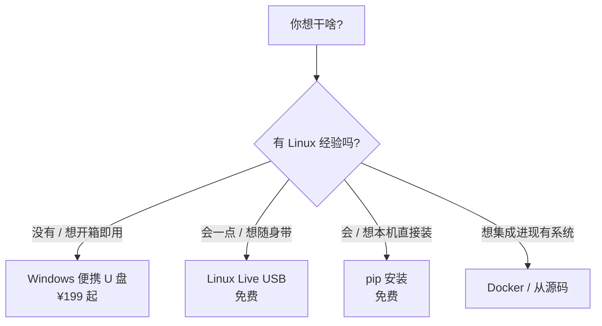

# 安装方式总览

按你需要选一种,五种路径任选其一。

| 方式 | 适用 | 价格 | 详细 |
|---|---|---|---|
| **Windows 便携 U 盘**(商业版) | Windows 用户,要"插上即用" | ¥199 起 | [详情](/zh/install/windows-portable) |
| **Linux Live USB**(开源版) | 极客 / 开发者,想随身带 AI 工作站 | 免费(MIT) | [详情](/zh/install/linux-live-usb) |
| **pip 安装** | 任何 Linux / Mac / WSL | 免费 | [详情](/zh/install/pip) |
| **Docker** | DevOps / 想容器化 | 免费 | [占位](/zh/install/docker) |
| **从源码** | 贡献者 / 二次开发者 | 免费 | [详情](/zh/install/from-source) |

## 怎么选?

## 商业版与开源版的边界

**商业版**(`u-hermes.org` 售卖)= 开源版核心 + 闭源启动器(Electron) + 虾盘云账户 + 初始 token + 售后

**开源版**(本社区文档) = `hermes-agent`(MIT)+ Linux Live USB 制盘脚本(MIT)

两者的核心 AI 能力完全相同,差别只在"包装"。开源版就是上游 NousResearch hermes-agent 加上中文 Live USB 启动方案。

::: info 提示
不知道选哪个?**先 pip 装一下试试**(20 秒搞定),感觉好用再考虑 U 盘版。
:::
